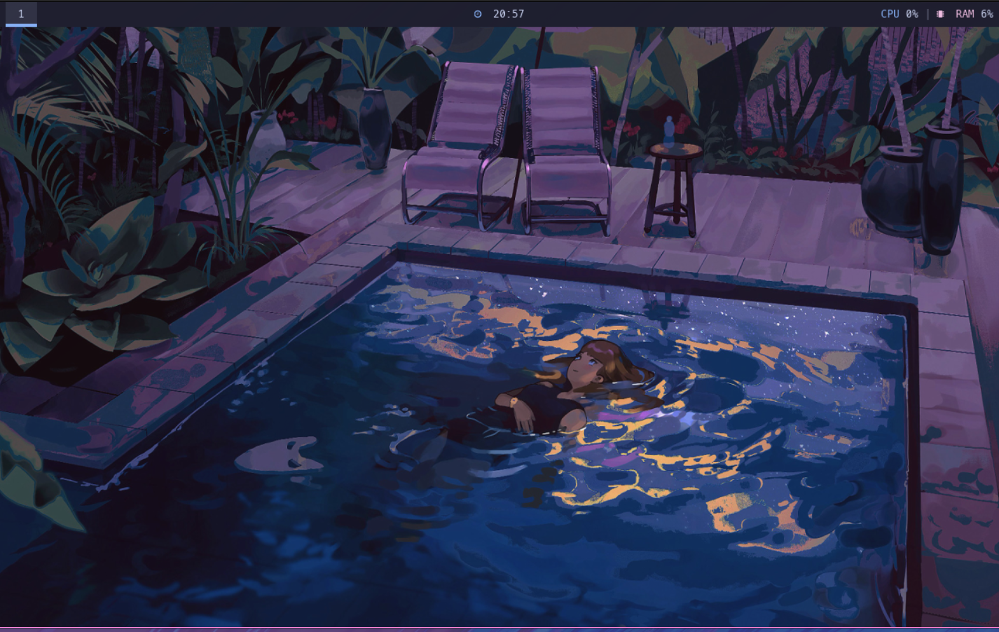
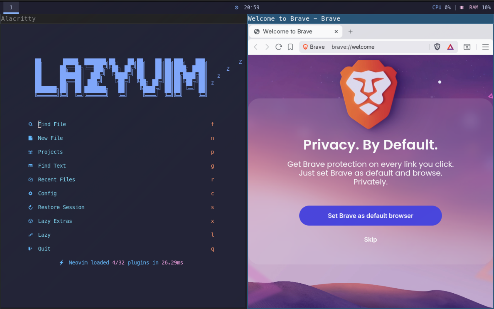

# quick_linux_environment

Turn a fresh ArchLinux with i3 environment into a beautiful and modern Linux





# Organization

```
quick_linux_environment/
├──config/
|    ├──alacritty/
|        └──alacritty.toml
|    ├──i3/
|       └──config
|    ├──polybar/
|       └──config.ini
|    ├──zsh
|       └──.zshrc
|    ├──quick_linux_img1
|    ├──wallpaper.jpg
├──desktop/
|   ├──app_brave.sh
|   ├──app_calculator-gnome.sh
|   ├──app_chromium.sh
|   ├──app_libreoffice.sh
|   ├──app_rofi.sh
|   ├──app_spotify.sh
|   ├──app_thunar.sh
|   └──app_zed.sh
├──terminal/
|   ├──app_alacritty.sh
|   ├──app_eza.sh
|   ├──app_i3.sh
|   ├──app_lazydocker.sh
|   ├──app_lazygit.sh
|   ├──app_neovim.sh
|   ├──app_polybar.sh
|  └──app_zsh.sh
├──boot.sh
├──check_system.sh
├──installation.sh
├──README.md
├──version
```

# Requirements

- ArchLinux

- i3-wm

- git

# Installation

## 1. Clone this repository

```
git clone https://github.com/phangelim/quick_linux_environment
```

## 2. Enter in the directory of the project

```bash
cd quick_linux_environment
```

## 3. Run the boot.sh

```
chmod +x boot.sh desktop/*.sh terminal/*.sh && ./boot.sh
```
